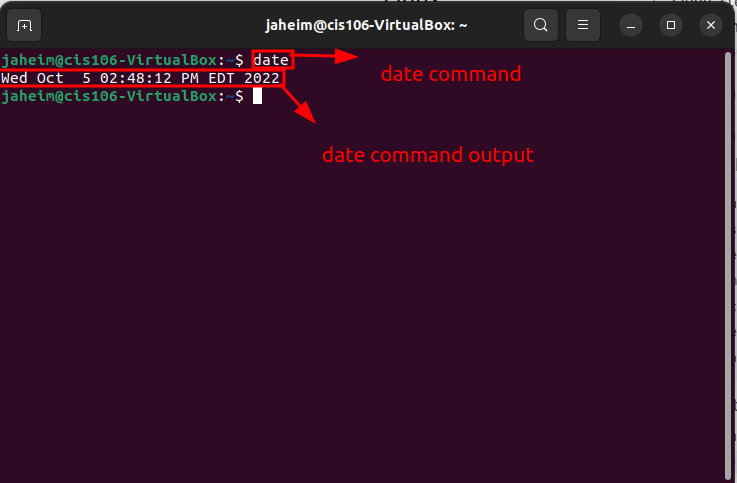
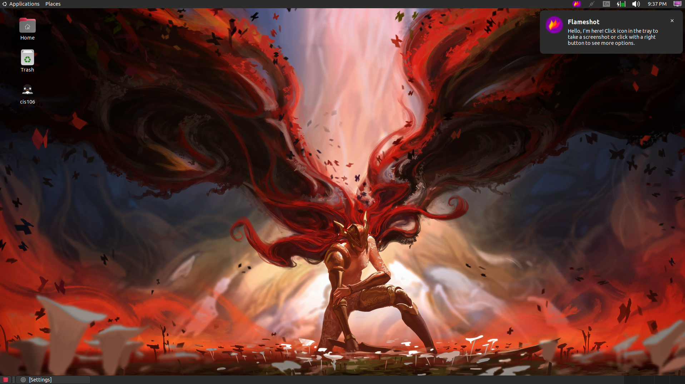

# Lab 3 Submission

# Question 1

## Question 2

## Question 3

| Program purpose     | Package Name     | Version                  |
| ------------------- | ---------------- | ------------------------ |
| Play a tetris game  | blockattack      | 2.7.0-1 amd64            |
| Play a video file   | dragonplayer     | 4:21.12.3-0ubuntu1 amd64 |
| Browse the internet | epiphany-browser | 42.4-0ubuntu1 amd64      |
| Read your email     | geary            | 40.0-2 amd64             |
| Play music          | juk              | 4:21.12.3-0ubuntu1 amd64 |

1. Which command did you use to install?
   - sudo apt install blockattack+ dragonplayer+ epiphany-browser+ geary+ juk
 
2. Which command did you use remove?
   - sudo apt install blockattack- dragonplayer- epiphany-browser- geary- juk
   
3. Which command did you use install and remove?
   - sudo apt install blockattack+ dragonplayer+ epiphany-browser- geary- juk-

## Question 4

| command | what it does                                        |
| ------- | --------------------------------------------------- |
| echo    | display a line of text                              |
| fortune | print a random, hopefully interesting, adage        |
| cowsay  | configurable speaking/thinking cow (and a bit more) |
| lolcat  | rainbow coloring effect for text console display    |
| figlet  | creates ext banners                                 |
| toilet  | display large colourful characters                  |
| rig     | Random Identity Generator                           |