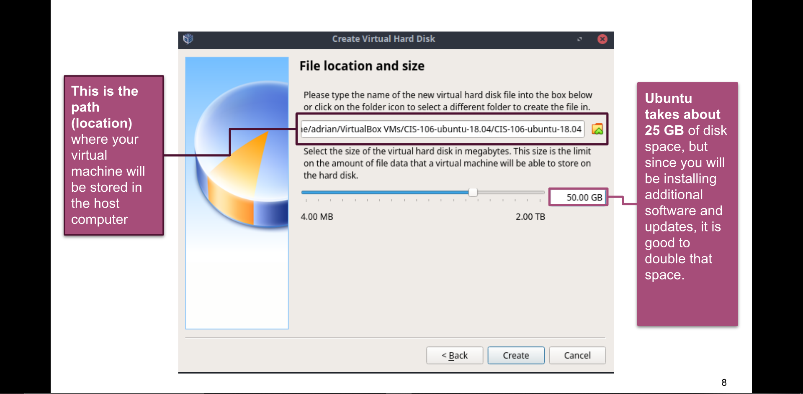

# Week Report 2

## The Basics of Virtualization

1. What is virtualization?
   - Virtualization is the replication of hardware to simulate a virtual machine inside a physical machine.
   
2. Types of virtualization
   - There are two types of virtualization. Type 1 runs on the hardware, while Type 2 runs on a host operating system.

3. Installing Ubuntu in Virtualbox

