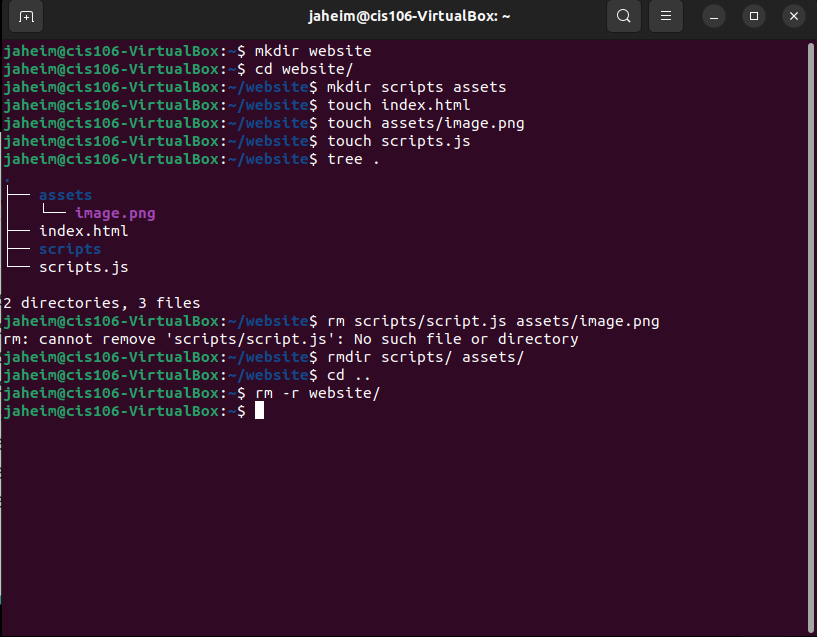
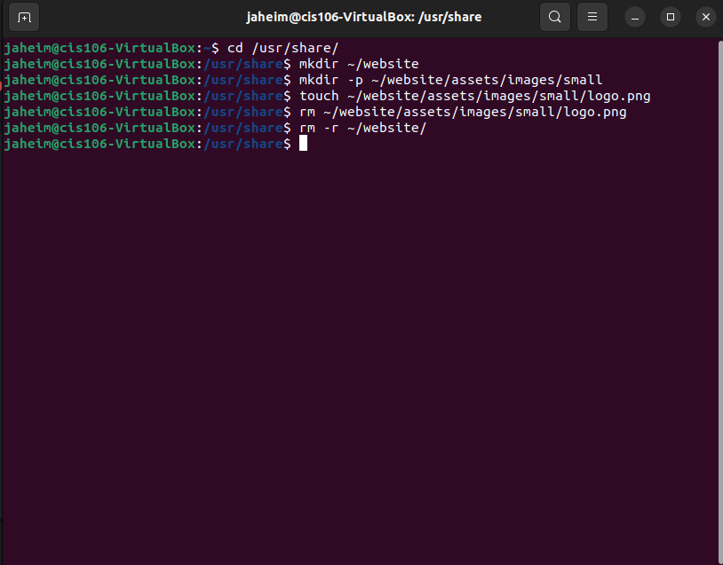
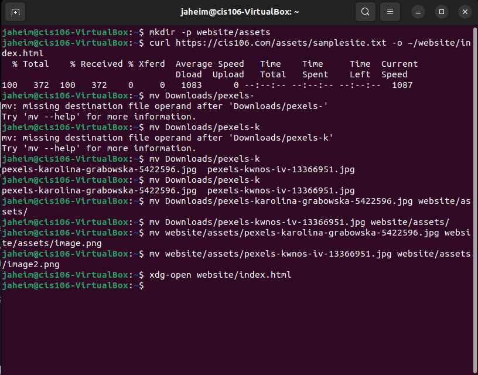
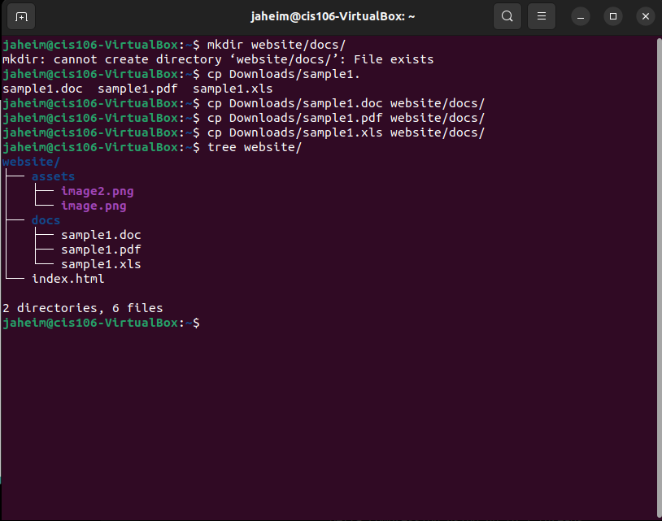

# What are command options?
- Command options modify or enhance a commands behavior.

## What are command arguments?
- Command arguments are the items that the command acts on.

## Which command is used for creating directories? Provide at least 3 examples.
- mkdir is used to create directories 
  - mkdir music
  - mkdir music/rap
  - mk music/rap/drake

## What does the touch command do? Provide at least 3 examples.
- touch is used create files
  - touch list
  - touch ~/Downloads/games.txt
  - touch "list of games.txt"

## How do you remove a file? Provide an example.
- You use rm to remove files
- rm list

## How do you remove a directory and can you remove non-empty directories in Linux? Provide an example
- You use rm -r to remove a directory.
- rm -r Downloads/games

## Explain the mv and cp command. Provide at least 2 examples of each
- The mv command moves and renames directories.
- The cp command copies files and directories from a source to a destination.
- mv Downloads/games.pdf Documents/
- mv games/ wallpapers/ rockmusic/ /media/student/flashdrive
- cp Downloads/wallpapers.zip Pictures/
- sudo cp -r script.sh program.py home.html assets/ /var/www/html/

## Practice 1

## Practice 2

## Practice 3

## Practice 4
